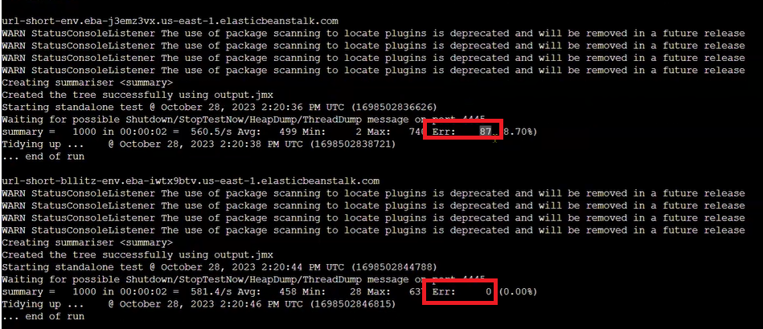

# Blitz the URL Shortener Application that is on a t2.micro

October 30, 2023

By:  Annie V Lam - Kura Labs

# Purpose

How to make a URL Shortener Application deployed on Elastic Beanstalk that is on a t2.micro handle more traffic

## Step #1 Re-deploy the URL Shortener Application on Elastic Beanstalk

## 1-A:  GitHub

GitHub is the repository where Jenkins retrieves the files to build, test, and deploy the URL Shortener application.  In order for the EC2, where Jenkins is installed, to get access to the repository a token needs to be generated from the GitHub and passed to the EC2.

[Generate GitHub Token](https://github.com/LamAnnieV/GitHub/blob/main/Generate_GitHub_Token.md)

## 1-B:  EC2 Instance

**Instructions to Setup a New EC2 Instance**

[Create EC2 Instance](https://github.com/LamAnnieV/Create_EC2_Instance/blob/main/Create_EC2_Instance.md)

[Create IAM Roles for Elastic Beanstalk and EC2](https://github.com/LamAnnieV/Setup_AWS/blob/main/Create_AWS_IAM_Roles.md)

**Shell Scripts for Install(s) in the Instance**

[Install "python3.10-venv", "python-pip", "python3-pip" and "unzip"](https://github.com/LamAnnieV/Instance_Installs/blob/main/02_other_installs.sh)

## 1-C: Jenkins

**Jenkins**
Jenkins automates the Build, Test, and Deploy the URL Shortener Application.  To use Jenkins in a new EC2, all the proper installs to use Jenkins and to read the programming language that the application is written in need to be installed. In this case, they are Jenkins, Java, Python, and Jenkins additional plugin "Pipeline Utility Steps".

**Instructions for Jenkins Install, Install Plugin(s), and Create Build**

[Jenkins Install](https://github.com/LamAnnieV/Instance_Installs/blob/main/01_jenkins_installs.sh)

[Install "Pipeline Utility Step" Plugin](https://github.com/LamAnnieV/Jenkins/blob/main/Install_Pipeline_Utility_Step_Plugin.md)

[Create Jenkins Multibranch Pipeline Build](https://github.com/LamAnnieV/Jenkins/blob/main/Jenkins_Multibranch_Pipeline_Build.md)

### Jenkins Build:  
In Jenkins create a build "Blitz" for the URL Shortener application from GitHub Repository https://github.com/LamAnnieV/Deployment_03 and run the build.  This build consists of build, test stage, and deploy stages

**Result:  Build and Test was successful, but the deployment will fail, since EBS has not been set up**

## Step #2 Install AWS ELastic Beanstalk CLI

In Deployment #2, the URL Shortener was manually deployed via AWS Elastic Beanstalk.  In this deployment, AWS CLI and AWS EB CLI were installed to automate the deployment of the URL Shortener.

**AWS EB CLI Install**

[Generate AWS CLI Credentials](https://github.com/LamAnnieV/Setup_AWS/blob/main/Generate_AWS_CLI_Credentials.md)

[Script to Install CLI](https://github.com/LamAnnieV/Instance_Installs/blob/ec378d89c22c95a909cb1283516e633ab6c9b153/03_CLI_installs.sh)

[Script to Install AWS EB CLI Part I](https://github.com/LamAnnieV/Instance_Installs/blob/main/04A_AWS_EB_CLI_install.sh)

[Script to Install AWS EB CLI Part II](https://github.com/LamAnnieV/Instance_Installs/blob/main/04B_AWS_EB_CLI_install.sh)

[Script to Install AWS EB CLI Part II](https://github.com/LamAnnieV/Instance_Installs/blob/main/04C_AWS_EB_CLI_install.sh)

**After installing the AWS EB CLI the application URL was displayed:**

## Step #3 Quality Assurance (QA) Engineer Blitzing our Infrastructure

**QA Engineer using JMeter to blitz our Infrastrucuture wiht 700 reqeusts:**

**QA Engineer automating the blitz to multiple domains at a time:**

**The result of 700 requests per second:**

There were zero errors (the number of requests that did not reach the instance) for all the domains

**QA Engineer using JMeter to blitz our Infrastructure with 1,000 requests:**

**The result of 1,000 requests per second:**

Every time a load is sent, the responses are different.  It is best practice to send multiple loads and take the average.  As seen in the results of blitzing 6 domains with 1000 requests/seconds 1 out of 6 was able to handle the request.  If we rely on the one infrastructure with zero errors, that would not be reliable.  

## Step #3 Configuring Auto Scaling Group 

Auto Scaling group allows the application to automatically scale based on defined criteria.  in the context of Elastic Beanstalk is to automatically manage the scaling of your application's Amazon EC2 instances based on defined criteria. This provides several benefits:

Automatic Scaling: An Auto Scaling group can automatically increase or decrease the number of EC2 instances running your application based on factors like increased traffic or decreased demand. This ensures that your application can handle varying workloads without manual intervention.  Let's [configure automatic scaling](https://github.com/LamAnnieV/Elastic_Beanstalk/blob/main/EBS_with_ELB) and see how it works.

**Auto-scaling group before blitzing**

[Image](Images/Instance_before_blitz.png)

**Auto-scaling group after blitzing with 1000 requests per second**

The auto-scaling group is configured with an upper threshold of 700 and a lower threshold of 600.  When the 1000 request was sent to the application, since it was above the 700 threshold it triggered the auto-scaling group to add another instance:

[Image](Images/after_blitz.png)

When the number of requests falls below the 600 threshold, the auto-scaling group will remove one instance:  

[Image](Images/Draining.png)

High Availability: Maintaining a desired number of EC2 instances, it helps ensure the availability and reliability of your application. If one EC2 instance becomes unhealthy or fails, the Auto Scaling group can replace it with a new one.

Cost Optimization: Auto Scaling can help optimize costs by allowing you to scale up when needed to handle traffic spikes and scale down during periods of lower demand. This can prevent over-provisioning and reduce unnecessary infrastructure costs.

Load Distribution: When used with Elastic Load Balancing, an Auto Scaling group can distribute incoming traffic evenly among multiple instances, enhancing the load balancing and fault tolerance of your application.

Self-Healing: If an instance within the Auto Scaling group becomes unhealthy, the group can replace it automatically, ensuring that your application continues to run smoothly.

Elasticity: It enables your application to be more elastic, automatically adjusting its capacity in response to changes in demand, which is particularly important for web applications with variable traffic patterns.

Deployment and Updates: When you deploy a new version of your application to Elastic Beanstalk, the Auto Scaling group can facilitate a rolling update by gradually replacing instances with the new version, minimizing downtime.

To use Auto Scaling with Elastic Beanstalk, you define scaling policies and criteria that dictate when and how the Auto Scaling group should adjust the number of instances. These policies can be based on CPU utilization, network traffic, custom metrics, or a schedule.

Overall, an Auto Scaling group within Elastic Beanstalk helps you ensure that your application is both highly available and able to handle varying workloads efficiently, while also optimizing infrastructure costs.

load balancers

auto-scaling group

cdn - if you are only doing static content

you can pay for the other tools, but is it the most cost-effective

Is there something that can handle the spikes in traffic on the holidays and go back to your infrastructure

Temporary power to handle the traffic, then go right back down. 

Autoscaling group

[link](https://github.com/LamAnnieV/Elastic_Beanstalk/blob/main/EBS_with_ELB)

What you can do to handle the request on those specific days?

The automatic Scaling tab,  scaling policy, app demands changes quickly but with a recurring pattern or when your ec2 requires more time to initialize.  Autoscaling policy to make sure the instance is ready

Predictive and scheduled scaling and overide at certain times using a schedule scaling...predetermine what's going to happen

Set an auto-scaling policy or a auto-scaling schedule to schedule for a specific time and day for you to scale to the required amount of instances or containers you need to accept that traffic 

The economic benefits of using auto-scaling and an ALB vs a stronger instance with more bandwidth (Like a c5.4xlarge)?

## Blitz Diagram

